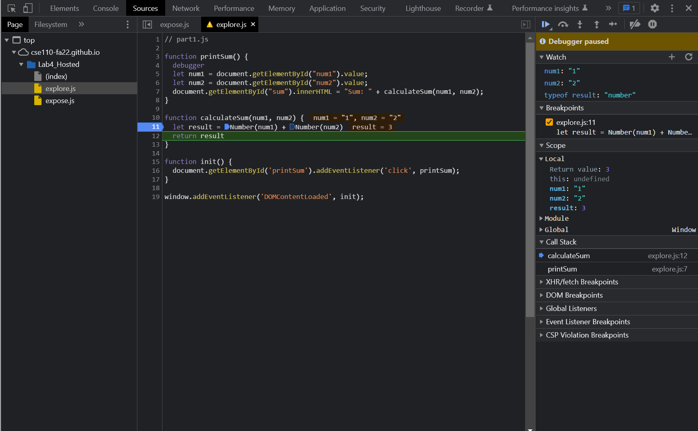

1. `num1` and `num2` were strings so the data type of `result` was also string, meaning that it was just the concatenation of the two numbers instead of addition
2. I would fix it by converting num1 and num2 to numbers
   